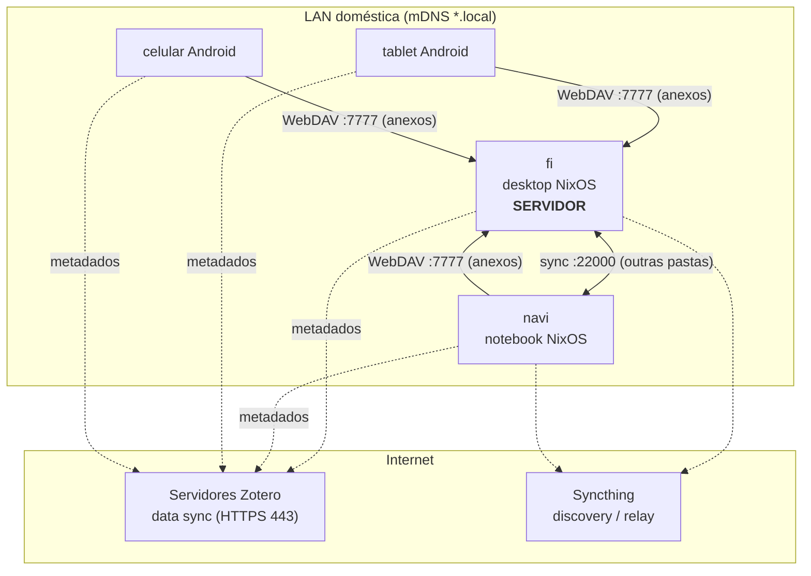
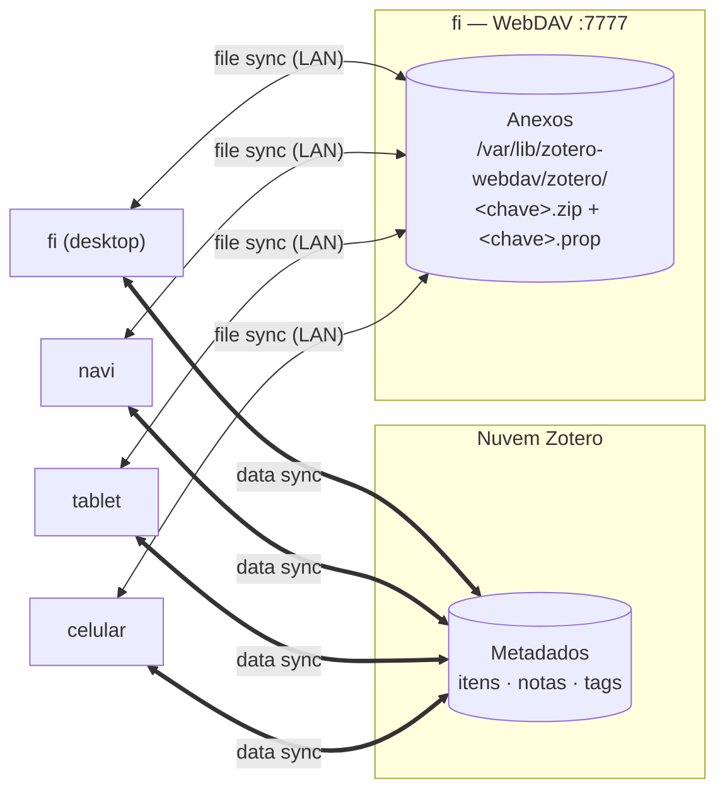
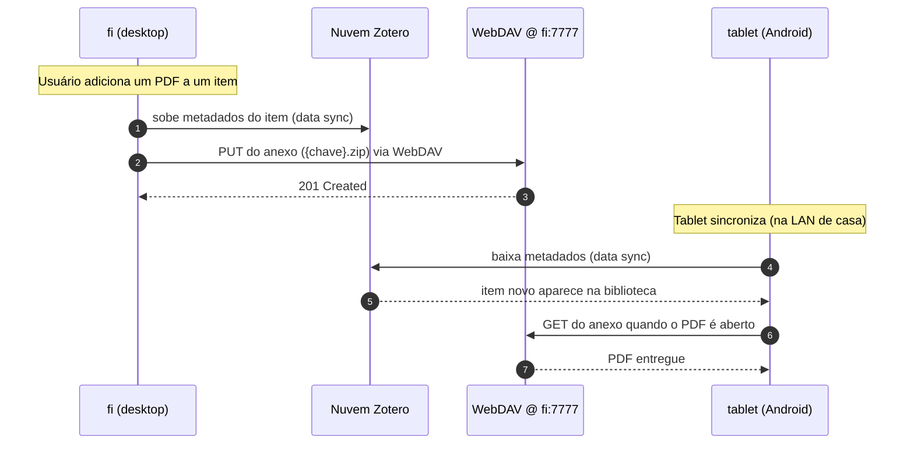
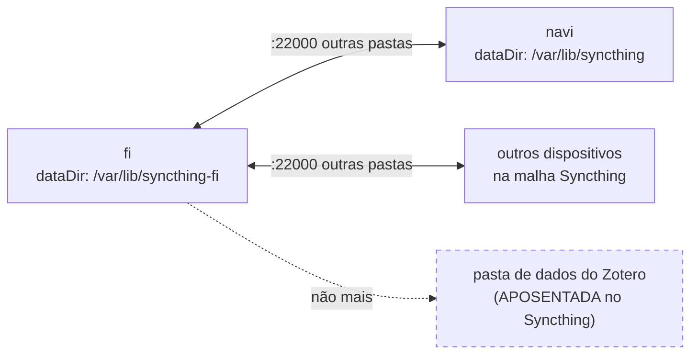

# Arquitetura de rede, serviços e sincronização do Zotero

Documento de referência sobre como as máquinas geridas por este repositório
(`fi`, `navi`) expõem e consomem serviços na rede doméstica, e sobre o esquema de
sincronização da biblioteca do Zotero entre desktop, notebooks, tablet e celular.

> **Escopo de rede:** tudo aqui é **LAN doméstica**. Não há VPN, domínio público
> nem TLS. Descoberta por mDNS (`*.local`). O único tráfego que sai para a
> internet é o _data sync_ do Zotero (metadados) e a descoberta/relay do
> Syncthing.

---

## 1. Inventário de dispositivos

| Dispositivo | Papel              | SO                 | Função no Zotero                        |
| ----------- | ------------------ | ------------------ | --------------------------------------- |
| **fi**      | Servidor + cliente | NixOS (este flake) | Hospeda o WebDAV; roda o Zotero desktop |
| **navi**    | Cliente            | NixOS (este flake) | Zotero desktop                          |
| **tablet**  | Cliente            | Android            | App Zotero                              |
| **celular** | Cliente            | Android            | App Zotero                              |

`fi` e `navi` são os dois hosts declarados em `flake.nix`
(`nixosConfigurations.{fi,navi}`). O módulo do WebDAV é importado **somente** no
`fi` (`nixos/hosts/fi/configuration.nix`).

---

## 2. Serviços expostos pelo `fi` na LAN

Definidos em `nixos/common/*`. Portas abertas no firewall:

| Porta | Proto | Serviço               | Módulo                     | Observação                   |
| ----: | :---: | --------------------- | -------------------------- | ---------------------------- |
|    22 |  TCP  | OpenSSH               | `common/base.nix`          | Só usuário `cawal`, root off |
|  5353 |  UDP  | Avahi/mDNS            | `common/base.nix`          | Publica `fi.local`           |
|  7777 |  TCP  | **WebDAV (Zotero)**   | `common/zotero-webdav.nix` | nginx + módulo dav           |
|  8384 |  TCP  | Syncthing (Web UI)    | `common/services.nix`      | `0.0.0.0:8384`               |
| 22000 |  TCP  | Syncthing (sync)      | `common/services.nix`      | `openDefaultPorts`           |
| 21027 |  UDP  | Syncthing (discovery) | `common/services.nix`      | `openDefaultPorts`           |

### Topologia de rede



Linhas cheias = tráfego só na LAN; linhas tracejadas = tráfego que sai para a
internet.

---

## 3. Modelo de sincronização do Zotero

O Zotero separa a biblioteca em **duas camadas independentes**, e a decisão-chave
deste setup é servir cada uma por um caminho diferente:

| Camada        | O que é                                  | Por onde vai                         | Custo              |
| ------------- | ---------------------------------------- | ------------------------------------ | ------------------ |
| **Data sync** | Itens, notas, tags, coleções (metadados) | Servidores do Zotero (nuvem, HTTPS)  | Grátis, ilimitado  |
| **File sync** | Anexos: PDFs, imagens etc.               | **WebDAV self-hosted no `fi`** (LAN) | Zero (disco local) |

Isso substitui o esquema antigo (Syncthing sincronizando a _pasta de dados
inteira_ do Zotero), que o app de Android não conseguia ler.



Cada dispositivo tem sua **própria pasta de dados local**; os metadados chegam da
nuvem e os anexos do WebDAV. A URL configurada em cada cliente é
`http://fi.local:7777/` — o próprio Zotero acrescenta `/zotero/` ao final.

### Sequência de uma sincronização

Exemplo: um PDF novo é adicionado no `fi` e depois aberto no tablet.



> **Ordem importa na carga inicial:** o `fi` (que já tem todos os anexos) deve
> concluir o upload para o WebDAV **antes** de os outros dispositivos ligarem o
> file sync — assim eles baixam de uma base completa.

---

## 4. O papel (remanescente) do Syncthing

O Syncthing continua sendo um serviço ativo no `fi` para **outras pastas** — ele
apenas **deixou de cuidar do Zotero**. É um mecanismo peer-to-peer independente da
nuvem Zotero e do WebDAV: sincroniza diretórios arbitrários diretamente entre os
seus dispositivos.



> **Regra de ouro:** a pasta de dados do Zotero **não pode** voltar a ser
> sincronizada pelo Syncthing enquanto o data sync + WebDAV estiverem ativos —
> dois mecanismos mexendo na mesma biblioteca corrompem o banco. Confira na Web UI
> (`http://fi.local:8384`), em **todos** os dispositivos, que a folder do Zotero
> está removida/pausada.

Configuração do serviço: `services.syncthing` em `nixos/common/services.nix`
(roda como usuário `cawal`; folders/devices são geridos pela Web UI, fora do
declarativo — daí `overrideFolders = false`).

---

## 5. Postura de segurança

**Hoje:** HTTP + Basic Auth (usuário `zotero`) na porta 7777, restrito à LAN pelo
firewall (sem port-forward no roteador → inacessível de fora de casa).

**Modelo de ameaça:** o único risco relevante é a senha do WebDAV trafegar em
base64 e ser capturável por quem esteja _sniffando a rede de casa_. Numa LAN
doméstica confiável, risco baixo. O `nginx` roda sob sandbox systemd forte
(`ProtectHome=true`, `ProtectSystem=strict`, usuário `nginx`), por isso os dados
ficam em `StateDirectory` (`/var/lib/zotero-webdav`) e não em `/home`.

### Opções de endurecimento (futuro, se necessário)

- **Tailscale (recomendado se um dia precisar de acesso fora de casa):** VPN mesh
  WireGuard. O transporte já é criptografado, então mantém-se HTTP simples por
  cima, **sem nenhuma dor de certificado** em nenhum dispositivo (inclusive
  Android, que tem app). Resolve criptografia **e** acesso remoto de uma vez.
- **HTTPS self-signed:** trivial no nginx, mas problemático nos clientes — o
  Zotero desktop exige o CA no trust store de cada máquina, e o **app Android
  pode simplesmente recusar** CAs adicionados pelo usuário. Ganho de segurança
  marginal na LAN. **Não recomendado.**
- **HTTPS com CA real (Let's Encrypt):** exige domínio e alcance externo; overkill
  para um serviço LAN-only.

---

## 6. Operação

### Onde ficam os dados no `fi`

| Caminho                              | Conteúdo                                     |
| ------------------------------------ | -------------------------------------------- |
| `/var/lib/zotero-webdav/zotero/`     | Anexos: pares `<chave>.zip` + `<chave>.prop` |
| `/var/lib/zotero-webdav/htpasswd`    | Credencial Basic Auth (usuário `zotero`)     |
| `/var/lib/zotero-webdav/.nginx-tmp/` | Área temporária de upload (rename atômico)   |

Gerido como `StateDirectory` do systemd (dono `nginx:nginx`, `0750`) → **persiste**
entre reinícios e rebuilds.

### Configurar um cliente Zotero

Preferências → Sync → File Syncing:

- "Sync attachment files in My Library using **WebDAV**"
- URL: `http://fi.local:7777/` (no próprio `fi`, `http://localhost:7777/`)
- Usuário `zotero` + senha → **Verify Server** (tem de ficar verde).

### Verificação rápida do servidor

```bash
# leitura (PROPFIND) — espera 207 Multi-Status
curl -u zotero:SENHA -X PROPFIND http://localhost:7777/zotero/ -H 'Depth: 1' -i
# escrita/leitura/remoção — espera 201 / conteúdo / 204
curl -u zotero:SENHA -T /etc/hostname http://localhost:7777/zotero/teste.txt -i
curl -u zotero:SENHA http://localhost:7777/zotero/teste.txt
curl -u zotero:SENHA -X DELETE http://localhost:7777/zotero/teste.txt -i
# contagem de itens já sincronizados
sudo ls /var/lib/zotero-webdav/zotero/*.prop 2>/dev/null | wc -l
```

### Recriar a senha (se esquecer)

```bash
nix-shell -p apacheHttpd --run "sudo htpasswd -c -B /var/lib/zotero-webdav/htpasswd zotero"
sudo chown nginx:nginx /var/lib/zotero-webdav/htpasswd && sudo chmod 640 /var/lib/zotero-webdav/htpasswd
sudo systemctl reload nginx
```

---

## 7. Limitações conhecidas

- **File sync só na LAN:** fora de casa, os metadados continuam sincronizando pela
  nuvem, mas os anexos só "alcançam" quando o dispositivo volta à rede de casa.
  (Aceitável: uso é quase sempre em casa.) Endurecer com Tailscale resolveria.
- **Só _stored files_:** anexos "vinculados" (_linked files_) não vão por WebDAV
  nem para o mobile — apenas cópias guardadas na biblioteca.
- **Só a biblioteca pessoal:** o WebDAV do Zotero não cobre _group libraries_.
- **Depende do `fi` ligado:** se o `fi` estiver desligado, o file sync pausa (os
  metadados seguem pela nuvem).

---

## 8. Arquivos relevantes no repositório

| Arquivo                            | Papel                                    |
| ---------------------------------- | ---------------------------------------- |
| `nixos/common/zotero-webdav.nix`   | Módulo do servidor WebDAV (nginx + dav)  |
| `nixos/hosts/fi/configuration.nix` | Importa o módulo (só no `fi`)            |
| `nixos/common/services.nix`        | Syncthing, firewall, serviços de sistema |
| `nixos/common/base.nix`            | Rede, SSH, Avahi/mDNS                    |
| `flake.nix`                        | Define os hosts `fi` e `navi`            |
